# Bungad & Villareal Management System — Whole-System Process & Connections

**What this document is:** the end-to-end map of the system — every layer, every
connection, every process, from a cashier tapping "Sale" to the row that lands in
SQLite and the audit line that proves who did it. Diagrams are Mermaid (GitHub
renders them inline) with an ASCII equivalent under each so the map survives a
plain-text reader.

For the *reference* tables (model field lists, endpoint contracts, env vars) see
[`SYSTEM_DOCUMENTATION.md`](SYSTEM_DOCUMENTATION.md). This file is the **flow**
view; that file is the **inventory** view. For the **schema's connections** — every
foreign key, its delete policy, and the ones that disagree with their neighbours —
see [`ERD.md`](ERD.md), which `manage.py erd --check` verifies against the models.

**Stack:** Django 5.1 + DRF 3.15 · React 19 + Vite 8 + Tailwind 4 · SQLite
(`DATABASE_URL` swaps to PostgreSQL) · 17 migrations · 55 model relationships
(`manage.py erd`) · 98 backend tests ·
17 frontend tests.

---

## 1. The system in one sentence

One company runs several **businesses**; each business runs through one or more
**branches**; one **catalog** feeds every business; and every request is pinned to
one business + a set of branches before it is allowed to read or write anything.

The two words that must never be confused:

| Term | Meaning | Who creates it | Role in isolation |
|---|---|---|---|
| **Business** | The top operating unit — "Villareal Spa Services", "BB Retail" | SUPERADMIN / OWNER | **The isolation boundary.** Every scoped row carries `business_id`. |
| **Branch** | One physical *outlet* of a business — "Cavite Main", "Dasma" | Business Manager and above | The unit of *operations*: stock, sales, rooms, attendance hang off it. |

---

## 2. Layered map — who talks to whom

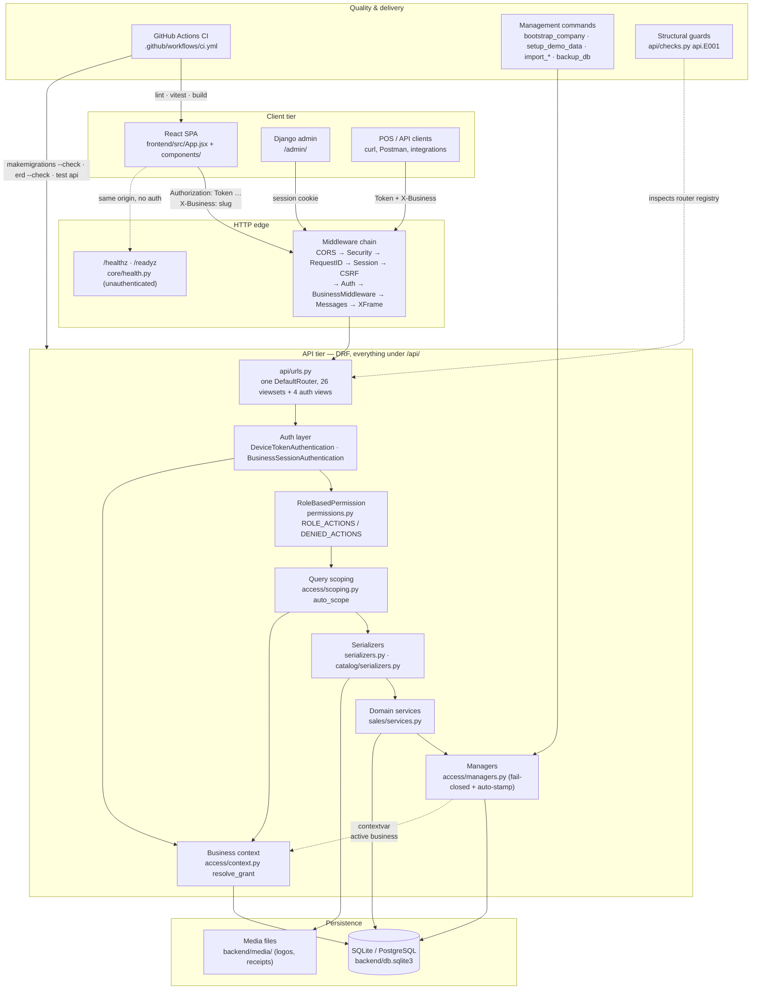

ASCII equivalent:

```
React SPA ─┐                                ┌─→ /healthz /readyz (no auth)
Django admin ├─ HTTP ─→ middleware chain ─┤
POS/curl ──┘   (Token + X-Business)        └─→ /api/ router
                                                   │
                             ┌─────────────────────┴────────────────────┐
                             ▼                     ▼                    ▼
                        authentication      RoleBasedPermission    ScopedQuerysetMixin
                        (DeviceToken)       (ROLE_ACTIONS)         (auto_scope)
                             │                     │                    │
                             └────── access/context.py: resolve_grant ───┘
                                                  │
                                     serializers → services → managers → DB
                                                  │
                                            media file store
```

**The single most important connection** is the one drawn three times above:
`access/context.py` feeds **authentication** (who is acting), **scoping** (what rows
they may see), and the **managers** (contextvar used by the fail-closed default
manager). One resolution, three consumers — so "the active business" can never
disagree with itself.

---

## 3. The data graph — every connection in the model

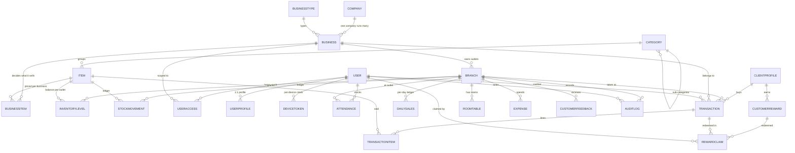

ASCII equivalent (the same graph as a tree — how it reads at a desk):

```
Company (singleton, pk=1)
├── BusinessType ──< Business >── Branch            [isolation ladder]
│                              │
│                              ├── InventoryLevel >── Item        (stock balance)
│                              ├── StockMovement   >── Item        (append-only ledger)
│                              ├── Transaction     >── ClientProfile, User(staff)
│                              │      └── TransactionItem >── Item  (+ own branch FK, price snapshot)
│                              ├── DailySales                        (unique branch+date)
│                              ├── RoomTable >── User(staff), Item   (occupancy state)
│                              ├── Attendance >── User               (unique user+branch+date)
│                              ├── Expense >── User(recorded_by)     (+ receipt file → media/)
│                              ├── CustomerFeedback >── ClientProfile, Transaction, User
│                              └── AuditLog >── User                 (+ request_id, ip, UA)
│
├── Category ──< Item ──< BusinessItem >── Business   [one catalog, many prices]
│
├── ClientProfile ──< CustomerReward ──< RewardClaim >── Transaction
│       (business FK, migration 0017)     (M2M rewards_applied on Transaction)
│
├── User ──< UserAccess >── Business (nullable) >── Branch[] (ticks)  [who may do what, where]
│    ├── UserProfile (1:1, skills M2M)
│    ├── DeviceToken (per device, expires, rotated_from chain, password fingerprint)
│    └── Attendance / Transaction(staff) / RewardClaim(claimed_by) / AuditLog(actor)
│
└── Roles: SUPERADMIN · OWNER · COMPANY_ADMIN · ACCOUNTANT
           BUSINESS_MANAGER · SUPERVISOR · CASHIER · STAFF
```

### 3.1 Connection ledger — what points at what, and why it exists

| From → To | Type | Why | What breaks without it |
|---|---|---|---|
| `Business → BusinessType` | FK, PROTECT | Business kind is data, not code (spa / retail / auto) | Retiring a type would orphan businesses |
| `Branch → Business` | FK, CASCADE | An outlet has exactly one parent business | "Which tenant?" becomes unanswerable |
| `BusinessItem → (Business, Item)` | FKs, `unique_together` | Same item is ₱150 at the spa, ₱130 at the kiosk | One row per business duplicating the catalog |
| `InventoryLevel → (Branch, Item)` | PROTECT, `unique_together`, `stock_qty >= 0` | Stock physically lives at an outlet | Negative stock; deleting a catalog line erases stock history |
| `StockMovement → (Branch, Item)` | PROTECT, append-only | The ledger that explains every balance | "Who took 6 bottles?" is unanswerable |
| `Transaction → (Business, Branch, ClientProfile?, User?)` | FKs; `unique_together (business, transaction_number)` | A receipt belongs to a tenant and an outlet | Two outlets colliding on a receipt counter |
| `TransactionItem → (Transaction, Branch?, Item?)` | FKs + **snapshots** (`unit_price`, `description`, `catalog_source`) | A receipt must reprint the price *charged*, even after a reprice | Historical receipts silently change value |
| `Transaction ↔ CustomerReward` | M2M `rewards_applied` | One sale can burn several rewards | No record of what was redeemed |
| `CustomerReward → ClientProfile` | FK, CASCADE | Loyalty accrues to a person | Rewards with no owner |
| `RewardClaim → (Reward, Transaction, User)` | FKs | Immutable proof of who redeemed what, when | Redemptions deniable |
| `ClientProfile → Business` | FK — **migration 0017** | **Customers are a tenant's asset**, not a shared pool | Cross-tenant leak: one till sees another's customers |
| `UserAccess → (User, Business?, Branch[])` | FK + M2M + DB CheckConstraint | Company roles carry no business; business roles must carry one | A company grant silently scoped, or a scoped grant widened |
| `DeviceToken → User` (+`rotated_from`, `password_fingerprint`) | FK + self-FK | Rotation, revocation, or a password change kills a credential *instantly* | One immortal token shared by every device |
| `AuditLog → (User, Business?, Branch?, request_id)` | FKs, SET_NULL | Every action traceable across proxy → API → log line | No forensic trail |

> **`PROTECT` vs `CASCADE` is a policy statement.** Anything that would rewrite
> history (catalog lines, outlets, items on a receipt) is `PROTECT` — you retire
> things with `is_active=False`, you never delete them. Anything genuinely owned
> and meaningless without its parent (`Branch` under `Business`,
> `TransactionItem` under `Transaction`) is `CASCADE`.

### 3.2 How a model becomes isolated

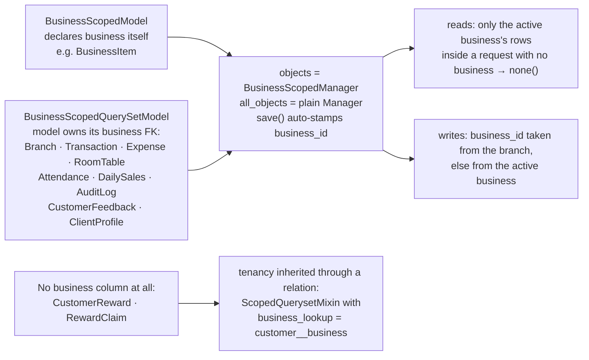

| Layer | File | What it guarantees |
|---|---|---|
| Model | `api/access/managers.py` | `objects` cannot return another tenant's rows; `all_objects` exists for reports, commands and the admin |
| Serializer | `api/serializers.py::_resolve_business` | Scoped callers get their own tenant whatever the payload says; company-wide callers must name one |
| Viewset | `api/access/scoping.py::ScopedQuerysetMixin` | `get_queryset()` narrowed by business, then by ticked branches |
| Build | `api/checks.py` → `api.E001` | A scoped model served by a viewset that forgot the mixin **fails `manage.py check`** |

---

## 4. Process A — one authenticated API request, gate by gate

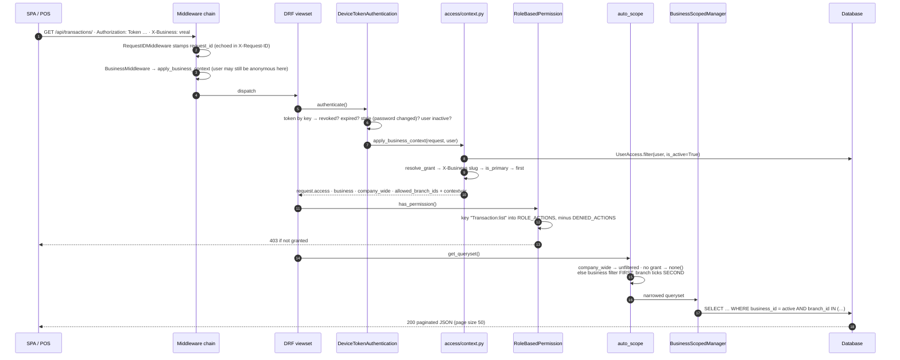

ASCII equivalent:

```
request ──► 1  CORS / security
          2  RequestIDMiddleware      → request_id stamped, echoed, pushed into log context
          3  Session / CSRF / Auth    → session traffic gets a real user here
          4  BusinessMiddleware       → first attempt to resolve the active business
          5  URL routing              → which viewset
          6  Authentication           → DeviceToken checked (revoked / expired / stale / inactive)
                                        → apply_business_context() AGAIN, now the user is known
          7  Permission               → "Resource:action" in ROLE_ACTIONS, minus DENIED_ACTIONS
          8  get_queryset()+auto_scope→ business filter FIRST, branch ticks SECOND, always ANDed
          9  Serializer               → tenant stamping / rejection on writes
         10  Service (writes)         → atomic transaction, ledger rows, audit
         11  Response                 → paginated JSON + X-Request-ID
         12  finally: clear_context() → contextvars never leak between requests
```

### 4.1 The nine rules the lifecycle enforces

| # | Rule | Where | Failure mode it prevents |
|---|---|---|---|
| 1 | Every request is identifiable | `RequestIDMiddleware` | Log lines that can't be tied to a response |
| 2 | A token dies the moment it should | `DeviceTokenAuthentication` | Immortal credentials after logout, rotation or a password change |
| 3 | The tenant is resolved once, and re-resolved if the user arrived late | `access/context.py::ensure_business_context` | Middleware seeing `AnonymousUser` for token traffic and under-scoping |
| 4 | A header can only **narrow** access | `resolve_grant` (unknown / unauthorised slug falls back to a real grant) | `X-Business: other-tenant` privilege escalation |
| 5 | Authorization is one matrix, not scattered `if role ==` | `permissions.py::ROLE_ACTIONS` + `DENIED_ACTIONS` | Policy drifting between viewsets |
| 6 | Reads fail **closed** | `auto_scope` returns `none()` with no grant | A forgotten grant exposing the whole company |
| 7 | Writes are tenant-stamped, never tenant-spoofed | `BusinessStampMixin` + `_resolve_business` | A 201 that silently disappears; a row filed in another tenant |
| 8 | Every stock change is in a ledger | `sales/services.py` | Balances that can't be explained |
| 9 | Context never outlives the response | `BusinessMiddleware` `finally: clear_context()` | Request A's tenant leaking into request B |

---

## 5. Process B — sign-in, the credential, the switcher

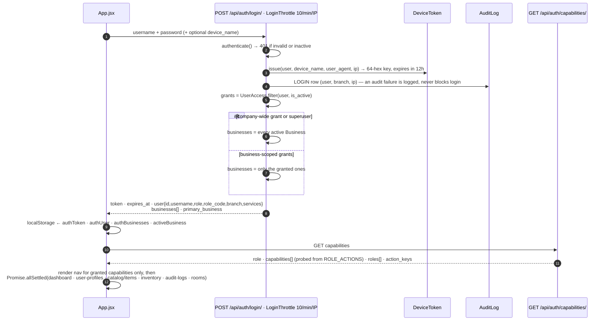

Four properties worth memorising:

* **Throttle first.** `LoginThrottle` caps the endpoint at **10 req/min/IP**, so
  password spraying is answered with `429` before it reaches `authenticate()`.
* **Login never invents a role.** The role returned is the role of the *chosen
  grant*; a superuser with no grant reads as `SUPERADMIN`, never as `OWNER`.
* **Capabilities are derived, not declared.** `UI_CAPABILITY_PROBES` probes the real
  matrix (`'inventory_manage': 'InventoryLevel:restock'`), so the SPA cannot offer a
  button the API would refuse. Until that call resolves, the nav shows nothing privileged.
* **Logout** revokes only the calling device's token and writes a `LOGOUT` audit row;
  the SPA clears all four `localStorage` keys so the next sign-in cannot inherit a
  stale tenant slug.

### 5.1 Business switching (accounts that hold more than one grant)

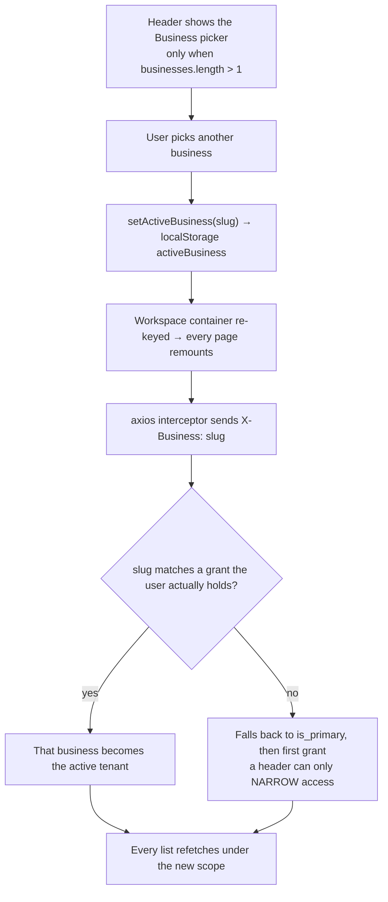

---

## 6. Process C — the sale (the core business process)

`POST /api/transactions/checkout/` → `api/sales/services.py::checkout()`, entirely
inside one `transaction.atomic` block: either all of it lands, or none of it does.

```mermaid
flowchart TD
    A["POST /transactions/checkout/<br/>branch · items · customer? · amount_paid · discount · reward_ids? · Idempotency-Key"] --> B{"Idempotency-Key already recorded?<br/>Transaction.all_objects — deliberately unscoped"}
    B -->|yes| C["Return the original receipt<br/>a retry can never double-sell"]
    B -->|no| D["Validate: at least one line · qty ≥ 1 · no negative money"]
    D --> E["Per line: BusinessItem of THIS branch's business<br/>effective_price = price_override ?? item.selling_price"]
    E --> F{"item.tracks_stock?"}
    F -->|yes| G["UPDATE … WHERE stock_qty ≥ qty<br/>0 rows → 400 Insufficient stock"]
    F -->|no| H["Service / non-stocked line"]
    G --> I["Totals"]
    H --> I
    I --> J["Tier discount = subtotal × customer discount rate"]
    J --> K["select_for_update each AVAILABLE reward of THAT customer<br/>percent or flat → status CLAIMED"]
    K --> L["total = max 0 · subtotal − cash − tier − rewards"]
    L --> M{"amount_paid ≥ total?"}
    M -->|no| N["400 Payment is less than the transaction total"]
    M -->|yes| O["Transaction: business = branch.business · TXN-YYYYMMDD-XXXXXXXX<br/>status PAID · points_earned = total ÷ 100 · tier snapshot"]
    O --> P["RewardClaim rows · rewards_applied M2M · claimed_in_transaction"]
    P --> Q["TransactionItem per line: price + description snapshot, own branch, catalog_source"]
    Q --> R["StockMovement reason SALE · balance_after · reference = receipt no."]
    R --> S["DailySales upsert on (branch, date): total_sales += total · count += 1"]
    S --> T{"customer?"}
    T -->|yes| U["total_spent += total · points += earned<br/>free_items += total ÷ 5000 · recalculate_tier()"]
    U --> V{"tier changed?"}
    V -->|yes| W["CustomerReward TIER_UPGRADE carrying the new discount"]
    V -->|no| X["commit — 201 with the receipt"]
    T -->|no| X
    W --> X
```

ASCII equivalent — the nine effects, in the order they happen:

```
checkout(branch, cashier, items, customer, amount_paid, discount, reward_ids, idempotency_key)
 1. replay guard       key already used → return that Transaction (unscoped lookup on purpose)
 2. pricing            BusinessItem(business=branch.business) → price_override ?? selling_price
 3. stock reservation  UPDATE inventory SET qty = qty − n WHERE branch/item AND qty ≥ n
                       0 rows updated → ValidationError (two tills can never oversell)
 4. discounts          cash discount + tier discount (% by loyalty tier) + claimed rewards
 5. payment guard      amount_paid < total → 400
 6. receipt            Transaction(business=branch.business, TXN-YYYYMMDD-XXXXXXXX, PAID,
                       points_earned = total/100, customer_tier_at_purchase)
 7. redemption         reward → CLAIMED + claimed_in_transaction + RewardClaim + M2M
 8. lines + ledger     TransactionItem (unit_price snapshot, own branch, catalog_source)
                       StockMovement(reason=SALE, balance_after, reference=receipt no.)
 9. roll-ups          DailySales(branch,date) += total
                      customer total_spent / loyalty_points / free_items_available
                      recalculate_tier() → on change, mint a TIER_UPGRADE reward
```

### 6.1 Why each step is shaped the way it is

| Step | Decision | What breaks if you "simplify" it |
|---|---|---|
| 1 | Replay read uses `all_objects` | A retry after the till switched business creates a **second sale** |
| 3 | Guarded `UPDATE … WHERE qty ≥ n` | Lost updates → negative stock on a busy Friday |
| 6 | `business = branch.business`, never a client field | The isolation boundary would rest on attacker-controlled input |
| 8 | Price snapshotted on the line | Yesterday's receipt changes value when an item is repriced |
| 7 | `select_for_update()` on rewards | The same reward burned in two concurrent sales |
| 9 | `DailySales` upsert | Dashboard cost grows with the size of the ledger |
| 9 | Tier upgrade mints a **row** | Two screens disagree about what the customer earned |

### 6.2 The sibling write processes

| Process | Entry point | What it writes, atomically |
|---|---|---|
| **Void a sale** | `POST /transactions/{id}/void/` → `void_sale()` | `VOID` / `VOIDED`, `[VOIDED] reason` appended to notes; stock **restored** per line; `StockMovement(reason='VOID')`; `DailySales.total_void += total`, `total_sales -= total`; `VOID` audit row |
| **Receive stock** | `InventoryLevel:restock` → `receive_stock()` | Creates the `InventoryLevel` if new; guarded increment; `StockMovement(reason='RECEIVE', reference, balance_after, created_by)` |
| **Outlet-to-outlet transfer** | `InventoryLevel:transfer` → `transfer_stock()` | Rejects cross-business and same-branch moves; guarded debit at source; `TRANSFER_OUT` **then** `TRANSFER_IN` so the ledger always balances |
| **Adjust stock** | `adjust_stock()` | Sets the balance and records the *delta* with reason `ADJUST` / `WASTE` |
| **Room check-in / out** | `POST /rooms/{id}/check_in/` · `check_out/` | `is_occupied`, `start_time`, `duration_minutes`, `assigned_staff`, `item`, `customer_name`; check-in refuses an occupied room |
| **Clock in / out** | `POST /attendance/check_in/` · `check_out/` | One row per (user, branch, date); status PRESENT / LATE / ABSENT / HALF_DAY |
| **Issue / claim a reward** | `POST /customer-rewards/` · `/{id}/claim/` | `CustomerReward(status='AVAILABLE')`; a claim flips status, stamps `claimed_at/by`, writes `RewardClaim` |
| **Create a customer** | `POST /clients/` | `_resolve_business`: a scoped caller always gets **its** business whatever the payload says; a company-wide caller must name one or gets 400. `business` is stripped on update — a customer never migrates tenants |
| **Create a business** | `POST /businesses/` (SUPERADMIN) | `post_save` signal auto-provisions a **"Main"** branch, so the new tenant is sellable the moment it exists |

---

## 7. Process D — how a yes/no authorization decision is made

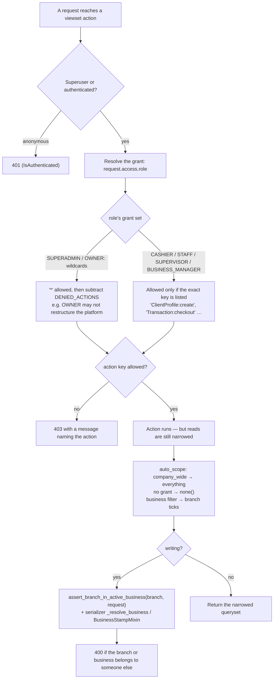

All eight roles, and the line that separates them:

| Role | Scope | Signature limits |
|---|---|---|
| **SUPERADMIN** | Platform | Creates/retires businesses and business types, hands out grants, edits company settings. The only role that may restructure the tenant itself |
| **OWNER** | Every business | Wildcard, but `DENIED_ACTIONS` blocks platform surgery |
| **COMPANY_ADMIN** | Every business | Everything except user management and business types |
| **ACCOUNTANT** | Company-wide money | Sales/expenses/reports; never selling |
| **BUSINESS_MANAGER** | One business (+ ticked branches) | Runs the business; cannot do company-level actions |
| **SUPERVISOR** | As above | …but cannot add or delete catalog entries |
| **CASHIER** | Ticked branches | Catalogs, clients, rooms, `checkout`/`void`, reward claiming, own attendance. Raw `create`/`update`/`destroy` on transactions are **not** granted |
| **STAFF** | Ticked branches | Customers, rooms, attendance. No transactions, no expenses, no inventory values |

---

## 8. Process E — the frontend: one shell, one HTTP client, one tenant

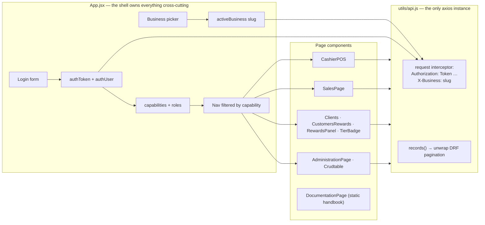

### 8.1 Page → endpoint map (the real connections, read from the code)

| Screen | Capability that reveals it | Endpoints it calls |
|---|---|---|
| `App.jsx` shell + dashboard | `dashboard` | `/auth/login/` · `/auth/logout/` · `/auth/capabilities/` · `/dashboard/summary/` · `/dashboard/recent/` · `/dashboard/branch_comparison/` · `/user-profiles/` (+ `me`) · `/catalog/items/` · `/catalog/inventory/` · `/audit-logs/` · `/rooms/` · `/branches/` |
| `CashierPOS.jsx` (the till) | `sales` | `/branch-catalog/by-branch/{id}/` · `/clients/` (+ `search`, `find_by_phone`) · `/customer-tier/by-customer/{id}/` · `/customer-rewards/by_customer/` · `/transactions/checkout/` · `/transactions/{id}/void/` · `/transactions/today/` |
| `SalesPage.jsx` (receipt ledger) | `sales` / `administration` | `/branches/` · `/catalog/items/` + `/catalog/business-items/` · `/clients/` · `/transactions/` |
| `ClientsPage.jsx` | `clients` | `/clients/` (+ `transactions`, `feedback`, `rewards`, `tier_info`) |
| `CustomersRewardsPage.jsx`, `CustomerRewardsPanel.jsx` | `customer_rewards` | `/clients/` · `/customer-rewards/` (+ `claim`) · `/customer-tier/` |
| `AdministrationPage.jsx` + `Crudtable.jsx` | `administration` | `/branches/` · `/businesses/` · `/business-types/` · `/catalog/*` · `/user-profiles/` · `/user-access/` · `/company/` · `/expenses/` · `/attendance/` · `/feedback/` · `/daily-sales/` · `/notifications/customer_alerts/` |
| `DocumentationPage.jsx` | `documentation` (every role) | none — the in-app handbook is static |

Three conventions every screen follows:

1. **One axios instance.** `utils/api.js` is the only client; the seven per-page
   copies (and their seven slightly different base URLs) are gone. `VITE_API_BASE_URL`
   sets the origin, so one build can target any backend.
2. **A sale is attempted with one key.** `newIdempotencyKey()` mints one UUID per
   attempted sale in both tills and reuses it until the receipt returns, so a
   double-tap or a network retry cannot create a second sale.
3. **Everything is fetched, nothing is seeded.** The shell loads dashboard, staff,
   catalog, inventory, rooms and audit rows with `Promise.allSettled` — one failing
   endpoint cannot blank the rest, and no screen renders invented data.

---

## 9. The business processes, end to end, in prose

### 9.1 Opening a new business (SUPERADMIN, about two minutes)

The superadmin signs in; their session resolves to a **company-wide** context, so
`request.business` is `None` and reads return every tenant. `POST /api/businesses/`
with a name, slug and `business_type` creates the row, and the `post_save` receiver
immediately creates a **"Main"** branch — the step that makes the tenant usable,
because a business with no outlet can be *seen* in the switcher but nothing can be
sold against it. The superadmin then links what it sells: usually `BusinessItem`
rows pointing at **existing** company `Item`s (optionally with a `price_override`)
rather than new catalog entries, which is the whole point of one shared catalog.
Staff arrive via `POST /api/user-access/` scoped to that business, with branches
ticked to pin a cashier to one outlet. Every step writes an `AuditLog` row carrying
the `request_id` of the call that caused it, and no step can touch another tenant —
`BusinessViewSet` is the one allowlisted unscoped viewset, because a `Business` row
*is* the boundary and only SUPERADMIN may write it.

### 9.2 A day at the till (CASHIER)

The cashier signs in on the front-desk device; `device_name` is stored with the
token, so an owner can later see *which* till held a credential. Their grant names
one business and ticks their outlet, so from that instant every query the app
issues is quietly `business=<theirs> AND branch_id IN (<ticked>)` — the app never
has to ask permission to be scoped. The POS loads `/branch-catalog/by-branch/{id}/`,
which is `BusinessItem` resolved through the branch's business with each line's
effective price and that branch's stock beside it. The cashier picks or scans lines,
optionally attaches a customer by phone, and sells. `checkout()` performs the nine
effects of §6 in one database transaction and returns a receipt number; the terminal
prints it against the receipt footer and tax default held on the `Company` singleton.
If the network hiccups, the POS resends **the same idempotency key** and receives the
same receipt instead of a second sale.

Mistakes go through `void`, never through an edit: raw `create` / `update` /
`destroy` are deliberately absent from a cashier's grant, because a sale whose stock
and ledger rows already exist can only be reversed by a process that unwinds them.

### 9.3 Rooms and services

`RoomTable` rows carry their branch and business, a room type, an optional catalog
`item` for the service in progress, assigned staff and the clock service began.
`available` / `occupied` answer the floor plan; `check_in` refuses a room that is
already taken (a double booking is a data error, not a UI problem); `check_out`
clears occupancy, and `time_remaining` is derived rather than stored. Rooms are
staff operations, so `STAFF` may see and update them while never seeing a receipt.

### 9.4 Loyalty, and the tenant boundary running through it

Loyalty is a **per-tenant promise**. `ClientProfile` carries the `business` FK added
in migration **0017** (existing customers backfilled from their transaction history),
so a spa customer is not a row the kiosk can pull up. `CustomerReward` and
`RewardClaim` have no business column of their own and therefore inherit tenancy
through the customer (`business_lookup='customer__business'`) — that indirection is
exactly the shape that leaked before it existed, and it is why the isolation tests
assert 404 rather than an empty list for a foreign reward: a leaked object is still a
leak when you refuse to render it.

Spending accrues on the customer; tiers recompute at checkout (BRONZE → SILVER →
GOLD → PLATINUM at ₱1k / 5k / 10k); free items credit at one per ₱5,000; a tier
change mints a `TIER_UPGRADE` reward carrying the new discount rate.
`POST /api/customer-detection/detect/` recognises a returning customer at the till;
`GET /api/notifications/customer_alerts/` tells a cashier "this customer has a reward
waiting" without opening a report — deliberately *not* branch-filtered, because
rewards attach to customers rather than to outlets, though the caller still needs a
grant that permits the action at all.

### 9.5 Money in, money out, and the trail behind it

`DailySales` is the per-outlet day book (`total_sales`, `total_expenses`,
`total_void`, `transaction_count`; unique on branch + date) and is read-only through
the API — it is a roll-up, and a hand-edited roll-up is a lie. Expenses are filed
against a branch and category with an optional receipt upload under `MEDIA_ROOT`.
ACCOUNTANT sees the whole company's money but is refused the ability to sell; a
Business Manager sees only their own business; `branch_comparison` is company-level
and therefore explicitly closed to Business Managers, with a test proving it stays
closed. Every consequential mutation lands in `AuditLog` with actor, tenant, outlet,
object, IP, user agent and `request_id`. Because `RequestIDMiddleware` echoes that id
in a response header and the JSON formatter puts it on every line emitted during the
request, one action can be followed from proxy to API to database without a
tracing system. `AuditLog` rows are append-only — the admin exposes the ledger for
reading and refuses add/change/delete, also under test.

### 9.6 Retiring things instead of deleting them

Nothing operational is deleted: items, branches and businesses are retired with
`is_active=False`, and `PROTECT` foreign keys turn the alternative into a hard error
instead of a silent cascade. Only rows that are meaningless without their parent
cascade. That is why the stock ledger survives a housekeeping purge and why an audit
row is readable years later.

---

## 10. The safety net — four build-time and six run-time guards

Isolation is enforced twice at runtime and twice at build time. Removing any one of
them still leaves a working guard; that redundancy is deliberate.

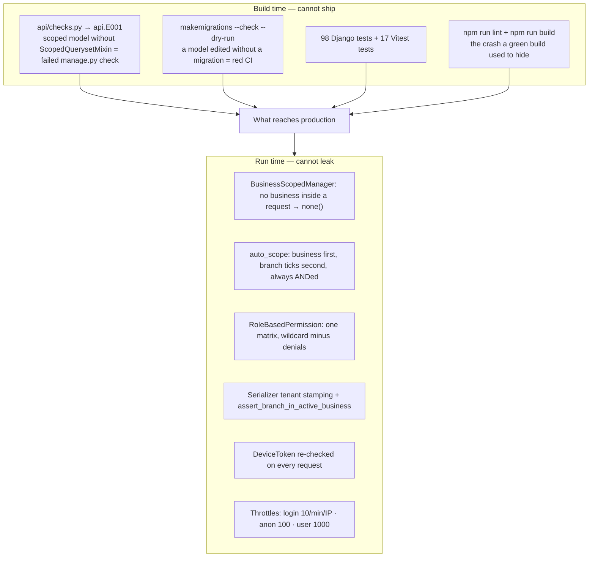

### 10.1 Test inventory (what each module defends)

| Module | Tests | Defends |
|---|---|---|
| `test_api.py` | 30 | Login, capabilities derived from the live matrix, role gating per action, direct `POST /transactions/` refusal, checkout deducts stock, void restores it, unauthenticated refusal, staffing gap report |
| `test_business_isolation.py` | 23 | A cashier sees only granted rows, **`X-Business` switching**, foreign rows answer **404**, company-wide sees everything, grant-less sees nothing, idempotent checkout, insufficient stock, cross-tenant client/reward invisibility, login payload shape |
| `test_throttle_transfers.py` | 13 | Login throttle returns 429, rate limits behave, `transfer_stock` balances the ledger and refuses cross-business moves |
| `test_role_capability.py` | 9 | Every capability probe matches its matrix key — no SPA button for a refused action |
| `test_write_scoping.py` | 6 | Cross-tenant writes rejected (branch, expense, room, client); the tenant is stamped, never spoofed |
| `test_audit_immutability.py` | 3 | `AuditLog` / `StockMovement` readable but not mutable through the admin |
| `test_admin.py` | 6 | The admin surfaces the ledger without letting it be rewritten |
| `src/test/App.test.jsx` | 17 | Null-safety on every shell fetch path, API-driven data loading, no component reaching a retired route |

### 10.2 Why `api.E001` is trusted

The check landed *after* the cross-tenant customer leak was fixed, and its first run
flagged `UserAccessViewSet`. Reading that viewset showed it filters by `user`, which
is **stricter** than business scoping, not looser — so it was allowlisted with that
reason written into `ALLOWED_UNSCOPED`. An allowlist whose every entry carries a
justification is the difference between a considered decision and an accident; that
is why the check's docstring says so out loud.

---

## 11. File → responsibility map (which file owns which connection)

| File | Owns | Talks to |
|---|---|---|
| `core/settings.py` | Middleware order, auth classes, pagination, throttles, CORS, JSON logging | everything below |
| `core/urls.py` | `/healthz`, `/readyz`, `/admin/`, `/api/` | `api/urls.py`, `core/health.py` |
| `api/urls.py` | The one router — 26 registrations + 4 auth views | every viewset |
| `api/access/models.py` | `UserAccess`, `DeviceToken`, staffing helpers | `Business`, `Branch`, `User` |
| `api/access/middleware.py` | `RequestIDMiddleware`, `BusinessMiddleware` | `context.py`, logging |
| **`api/access/context.py`** | `resolve_grant` · `apply_business_context` · `ensure_business_context` | middleware, authentication, scoping, permissions, serializers |
| `api/access/authentication.py` | `DeviceTokenAuthentication`, `BusinessSessionAuthentication` | `DeviceToken`, `context.py`, the OpenAPI scheme |
| `api/access/scoping.py` | `auto_scope`, `assert_branch_in_active_business`, `ScopedQuerysetMixin` | `context.py`, every scoped viewset |
| `api/access/managers.py` | `BusinessScopedManager`, `BusinessStampMixin`, `resolve_business_id` | contextvars, every scoped model |
| `api/access/request_context.py` | Django-free contextvars + log context | managers, JSON formatter |
| `api/permissions.py` | `ROLE_ACTIONS`, `DENIED_ACTIONS`, `RoleBasedPermission`, `UI_CAPABILITY_PROBES` | every viewset, `/auth/capabilities/` |
| `api/checks.py` | `api.E001` + `ALLOWED_UNSCOPED` | the router registry |
| `api/models.py` | Operational models + re-exports of the domain models | every domain package |
| `api/business/models.py` · `signals.py` | `BusinessType`, `Business`, the auto-"Main"-branch receiver | `Branch` |
| `api/catalog/models.py` | `Category`, `Item`, `BusinessItem`, `InventoryLevel`, `StockMovement` | `Business`, `Branch` |
| `api/sales/services.py` | `checkout`, `void_sale`, `receive_stock`, `transfer_stock`, `adjust_stock` | catalog + sales models |
| `api/views.py` | Auth views, operational viewsets, dashboard, detection, notifications | permissions, scoping, services |
| `api/serializers.py` | Operational serializers, `_resolve_business` | `context.py`, models |
| `api/admin.py` | Read-only ledger surfaces; tokens cannot be hand-minted here | models |
| `api/management/commands/` | `bootstrap_company`, `create_demo_users`, `setup_demo_data`, `import_vss_services`, `import_vreal_products`, `backup_db` | services + models, outside any request (so `all_objects` semantics apply) |
| `frontend/src/App.jsx` | Auth, session, nav, business switcher, shell data loading | `utils/api.js`, `utils/session.js` |
| `frontend/src/utils/api.js` | The single axios client and its interceptors | every page |
| `frontend/src/utils/session.js` | `localStorage` keys, `X-Business`, `newIdempotencyKey` | `api.js`, `App.jsx` |
| `frontend/vite.config.js` | Vitest jsdom env, setup file, `esbuild.jsx: automatic`, coverage | `src/test/*` |
| `.github/workflows/ci.yml` | Backend and frontend pipelines | both stacks |

> Management commands run **outside** a request, so the fail-closed manager returns
> system-wide rows there (`is_in_request()` is false). That is intentional — a
> bootstrap command must be able to create every tenant — but it also means a command
> is the one place a filter must be written by hand.

---

## 12. Delivery: how the code becomes a running system

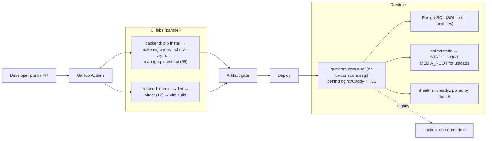

Run locally today:

```bash
# backend
cd backend && python manage.py migrate && python manage.py bootstrap_company
python manage.py create_demo_users && python manage.py runserver   # :8000

# frontend
cd frontend && npm ci && npm run dev                               # :5173 → VITE_API_BASE_URL
```

Production gates that are already in the code but must be *set*, not coded:
`DJANGO_DEBUG=False`, a real `DJANGO_SECRET_KEY`, explicit `DJANGO_ALLOWED_HOSTS`,
an explicit `CORS_ALLOWED_ORIGINS` (SPA origin only), PostgreSQL in `DATABASES`, and
`collectstatic`. HSTS, `SECURE_CONTENT_TYPE_NOSNIFF`, HttpOnly + `Samesite=Lax`
cookies and `X-Request-ID` echoing are already on.

---

## 13. The complete connection list — every route the system exposes

| Group | Route prefix | Notable custom actions | Scoped by |
|---|---|---|---|
| Auth | `POST /api/auth/login/` · `logout/` · `rotate-token/` · `GET capabilities/` | — | `AllowAny` on login, throttle 10/min/IP |
| Docs | `/api/schema/` · `/api/docs/` · `/api/redoc/` | — | open |
| Health | `/healthz` · `/readyz` | — | unauthenticated, outside `/api/` |
| Businesses | `/api/businesses/` · `/api/business-types/` | — | allowlisted (they *are* the boundary) |
| Access | `/api/user-access/` | grants filtered to `user=request.user` | per-user — stricter than tenant |
| Company | `/api/company/` | singleton settings | allowlisted, admin-only |
| People | `/api/user-profiles/` | `me`, `staffing`, `stats` | allowlisted; a profile carries no tenant |
| Outlets | `/api/branches/` | `staffing`, `stats` | `branch_lookup='pk'` |
| Catalog | `/api/catalog/items/` · `categories/` · `business-items/` | — | `Item`/`Category` are company-wide; `business-items` per tenant |
| Stock | `/api/catalog/inventory/` · `stock-movements/` | `restock`, `transfer` | `inventory_levels__branch_id` |
| POS catalog | `/api/branch-catalog/` | `by-branch/{id}` | by branch; action-only viewset |
| Sales | `/api/transactions/` | `checkout`, `void`, `today`, `stats` | business, then branch |
| Ledger | `/api/daily-sales/` | read-only | business, then branch |
| Clients | `/api/clients/` | `search`, `find_by_phone`, `transactions`, `feedback`, `rewards`, `tier_info` | `business` FK (migration 0017) |
| Loyalty | `/api/customer-rewards/` · `reward-claims/` | `claim`, `by_customer` | `business_lookup='customer__business'` |
| Loyalty helpers | `/api/customer-tier/` · `customer-detection/` · `notifications/` | `by-customer/{id}`, `detect`, `customer_alerts` | action-only viewsets; a grant is still required |
| Rooms | `/api/rooms/` | `available`, `occupied`, `check_in`, `check_out` | business, then branch |
| Staffing | `/api/attendance/` | `today`, `my_records`, `check_in`, `check_out`, `stats` | business, then branch |
| Feedback | `/api/feedback/` | — | business, then branch |
| Money | `/api/expenses/` | — | business, then branch |
| Audit | `/api/audit-logs/` | — | business, then branch |
| Dashboard | `/api/dashboard/` | `summary`, `recent`, `stats`, `branch_comparison`, `by-branch/{id}` | scoped per branch in the view |

**Retired and never coming back** (`urls.py` records the decision): the seven
per-catalog routes `vss-services`, `vreal-products`, `bb-products`,
`panganan-menus`, `kb-items`, `auto-spa`, plus `/products/` and `/branch-inventory/`.
Everything they served lives under `/api/catalog/*`, and a frontend test asserts no
component reaches a dead path.

---

## 14. Honest limits — what this system is *not*

| Limit | Why it matters | What closing it takes |
|---|---|---|
| **One company, single box** | `Company` is a singleton (pk=1), SQLite is the default, `bootstrap_company` assumes one group | A real `company_id` on the tenant root, plus Postgres, before a second legal entity |
| **`App.jsx` is 1,889 lines** | The shell owns auth, nav, the switcher, six fetches and five tabs; state-in-effect warnings are known | A refactor pass — deliberately kept out of the security PR |
| **UI tenant selection for company-wide roles** | The API now rejects an ambiguous client creation with 400; the form should offer a picker or surface that message | Verify/extend the OWNER + SUPERADMIN create-client form |
| **Throttle state is in-process** | Rate limits are per-worker; two workers double the budget | A cache/Redis throttle backend before horizontal scaling |
| **Reports read the roll-up, not the ledger** | `DailySales` is fast but only as correct as the writers maintaining it | A reconciliation command comparing `DailySales` to `Transaction` |
| **Importers de-duplicate by name** | Same-named services across businesses can collapse into one `Item` | Key on `(business, name)` or a per-business SKU namespace |
| **No real-time layer** | Room boards and dashboards refresh on navigation, not on change | A channel/WebSocket layer; nothing in the current design blocks it |

---

## 15. The whole system on one screen

```
                     WHO                                  WHERE                        WHAT
        ┌─────────────────────────────┐     ┌─────────────────────────────┐   ┌──────────────────┐
        │ User ── UserAccess(role,    │────▶│ Business ──< Branch         │──▶│ everything       │
        │  business?, branches[])     │     │  (tenant)      (outlet)     │   │ operational      │
        └──────────────┬──────────────┘     └──────────────┬──────────────┘   └────────┬─────────┘
                       │                                   │                           │
              DeviceToken (expires)                 BusinessType              Transaction ─┬─ TransactionItem
                       │                              │                           ├─ StockMovement (ledger)
              RoleBasedPermission              Item ── BusinessItem          ClientProfile ── CustomerReward ── RewardClaim
              "Resource:action" ∈ ROLE_ACTIONS (one catalog, per-tenant price)  (tenant FK)   (tenant via customer)
                       │                                   │                           │
              auto_scope: business THEN branches     DailySales · Expense        Attendance · RoomTable
                       │                          CustomerFeedback                Feedback
              BusinessStampMixin on write                     │                           │
                       └─────────────────────────────────────┴──────── AuditLog + request_id
                                                            ▼
                          CI: api.E001 · migrations · erd --check · 98 + 17 tests · lint · build
```

Read it as the three questions the system always answers, in this order:

1. **Who** is acting — a `DeviceToken` → a `User` → one `UserAccess` grant.
2. **Where** may they act — a `Business` (the boundary) and the `Branch` ticks inside it.
3. **What** may they do — one matrix key, `"<Resource>:<action>"`; if it is not
   granted the answer is 403 *before* a queryset is ever built.

Everything else in this document is detail.

---

*Verified against the tree while writing: migrations `0001`–`0017`, 26 router
registrations, 98 backend tests, 17 frontend tests, `manage.py check` clean (including
`api.E001`), `manage.py erd --check` clean (55 relationships), no pending migrations.*


